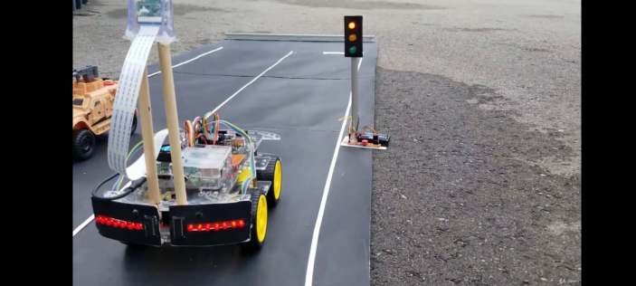
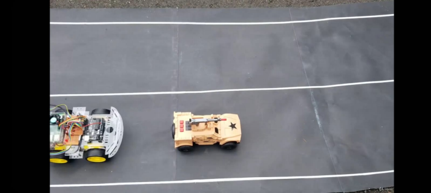
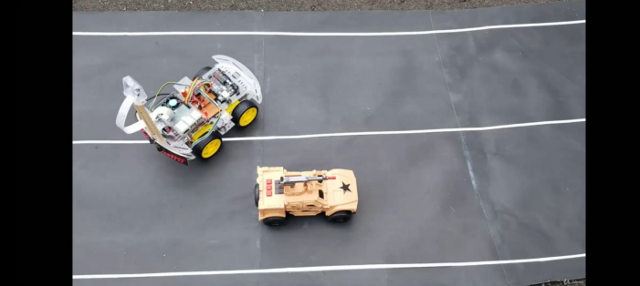
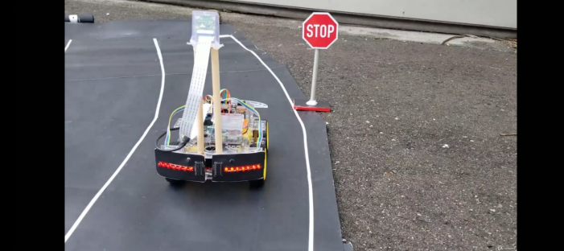
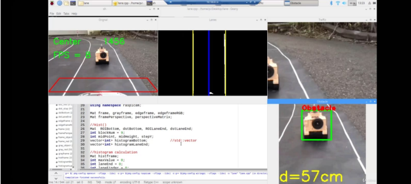
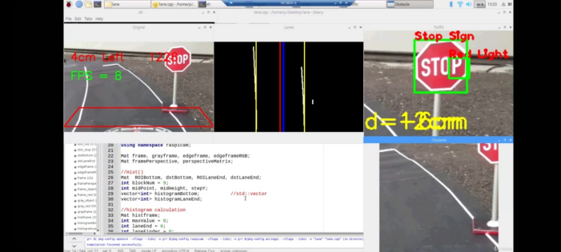

# 🚗 Autonomous Car – Obstacle Detection System

A small-scale autonomous vehicle prototype that performs real-time 
obstacle detection and avoidance using computer vision and sensor 
fusion. Built as a final year B.E. Computer Engineering project.

---

## 🔧 Hardware Used
- Raspberry Pi 3B+
- Arduino Uno
- Pi Camera
- Ultrasonic Sensors (HC-SR04)
- L298N Motor Driver

---

## 💻 Software & Technologies
- Python
- OpenCV
- YOLOv5n (Object Detection)
- TensorFlow Lite
- Arduino IDE (C/C++)

---

## ⚙️ How It Works
1. Pi Camera captures live video frames
2. YOLOv5n model detects objects in real-time
3. Ultrasonic sensors measure obstacle proximity
4. Sensor fusion combines both inputs for decision making
5. Arduino sends commands to motor driver to stop or turn

---

## 📊 Results
| Metric | Value |
|--------|-------|
| Detection Accuracy | 87% |
| Frame Rate | 10–15 FPS |
| Response Time | 70–90 ms |
| Sensor Range | Up to 4 meters |
| Battery Life | ~40 minutes |

---

## 📸 Project Images

### 🚗 Prototype

---

### 🎯 Object Detection in Action

---

### 🛑 Stop Sign Detection

---

### 📏 Distance Measurement

---

### 💻 Code Interface

---

### 📡 Sensor Output

---

## 📁 Code
Coming Soon

---

## 📄 License
This project is for educational purposes only.
